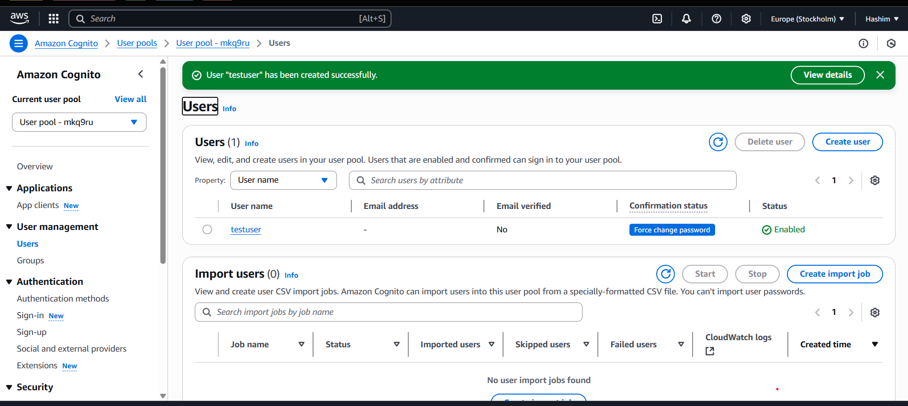

#  Amazon Cognito Integration for DocuBot

##  What is Amazon Cognito?

Amazon Cognito is a fully managed authentication service that allows you to:

- Add secure **sign-up and sign-in** to the application
- Manage **user identities and groups**
- Integrate with **OAuth 2.0** and **OpenID Connect**
- Issue **JWT tokens** for authenticated access

---

##  Why Use Cognito in DocuBot?

DocuBot aims to securely provide question-answeering over internal company documents. Cognito enables:

| Feature                      | Purpose                                                       |
|-----------------------------|---------------------------------------------------------------|
|  Secure User Authentication | Allows employees to log in safely                            |
|  Role-based Access         | Grant document access by department or user group            |
|  Personalized QA           | Tailor answers per user context                              |
|  Audit Logging             | Track who asked what and when                                |

---

##  Cognito Setup Instructions (AWS Free Tier)

> All steps are **Free Tier** eligible for up to **10,000 Monthly Active Users (MAUs)**.

---

###  1. Create a User Pool

1. Go to [AWS Cognito Console](https://console.aws.amazon.com/cognito/)
2. Click **“Create user pool”**
3. Name it `DocuBotUserPool`
4. Choose **Username or Email** as the sign-in method
5. Enable:
   -  Self-registration (for user sign-up)
   -  Email verification

---

###  2. Create an App Client

1. Navigate to **App integration > App clients**
2. Click **“Add an app client”**
3. Name it: `docubot-client`
4. Uncheck  “Generate client secret”
5. Save the **App Client ID** for later

---

### 3. Set Up Hosted UI

1. Go to **App Integration > Domain name**
2. Choose and configure a domain (e.g. `docubot.auth.us-east-1.amazoncognito.com`)
3. In **Callback URLs**, add your redirect URL (e.g. `https://localhost:8501`)
4. In **Sign-out URLs**, add same or similar
5. Enable **OAuth Scopes**:
   - ✅ `email`
   - ✅ `openid`
   - ✅ `profile`

---

### ✅ 4. Create a Test User (Optional for Testing)

1. Go to **Users and Groups**
2. Click **“Create user”**
3. Use:
   - Username: `testuser`
   - Email: `you@example.com`
   - Password: `Test123!` (must be complex)
   - ✅ Mark email as verified
4. Click **Create**

---

### ✅ 5. Test Login via Hosted UI

1. Go to **App Integration > Launch Hosted UI**
2. Sign in with your test user
3. You’ll be redirected to your callback URL with a `?code=...` in the URL

---

### ✅ 6. Exchange Authorization Code for Tokens

Use **Postman** or `curl` to exchange the code for tokens:

**POST** to:
https://<your-domain>.auth.<region>.amazoncognito.com/oauth2/token

**Headers:**
```http
Content-Type: application/x-www-form-urlencoded

grant_type=authorization_code
client_id=<your-app-client-id>
code=<code-from-url>
redirect_uri=<your-callback-url>

Response will be
{
  "access_token": "...",
  "id_token": "...",
  "refresh_token": "...",
  "token_type": "Bearer",
  "expires_in": 3600
}


Then use token in main which is now commented(only this part)
from utils.cognito_auth import get_user_info

token = input("Paste your Cognito id_token: ")
user_info = get_user_info(token)

if user_info:
    print("✅ Logged in as:", user_info["email"])


    